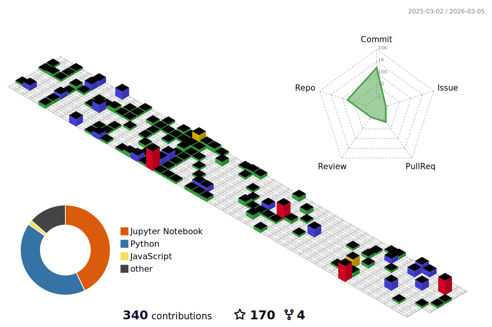

#  Jamshed Ali 
  
**`AI Engineer (Focused on Gen AI & And Agentic AI)`**
  
An AI Engineer focused on Generative AI and Agentic AI, building intelligent systems that combine creativity with autonomous decision-making. I specialize in developing innovative AI solutions using modern frameworks and techniques.
 

---

<!-- 

 -->

  
  
  
  
  
  
   
  
  
   
  
   
  

 

---

  
  
  

---

  

<!--  -->

---

