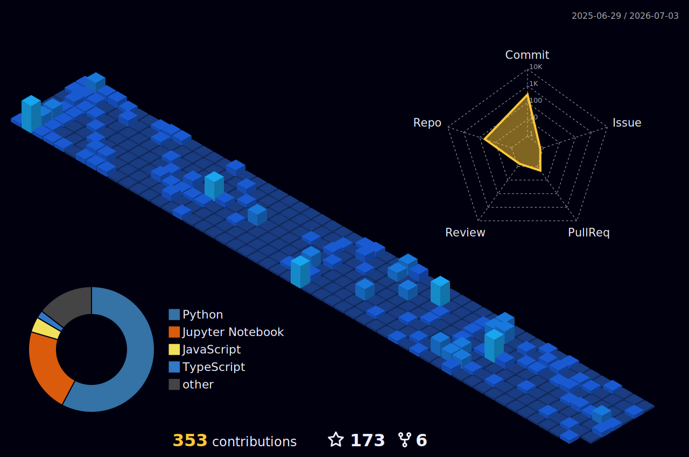

<!--#  Jamshed Ali 
  
**`AI Engineer (Focused on Gen AI and Agentic AI)`**
  
An AI Engineer focused on Generative AI and Agentic AI, building intelligent systems that combine creativity with autonomous decision-making. I specialize in developing innovative AI solutions using modern frameworks and techniques.
 

 -->

  <h1>
    
  </h1>

  

### About Me
*I design and ship autonomous AI systems that reason, retrieve, and act — not just generate text. My work spans RAG pipelines, multi-agent orchestration, and real-time voice interfaces, backed by end-to-end deployment across Docker, AWS, Render, and FastAPI.*

---

  

<table align="center">
<tr>
<td align="right"><b>LLM Providers</b></td>
<td>

</td>
</tr>
<tr>
<td align="right"><b>AI / Agentic Frameworks</b></td>
<td>

</td>
</tr>
<tr>
<td align="right"><b>ML / DL Libraries</b></td>
<td>

</td>
</tr>
<tr>
<td align="right"><b>Retrieval & Vector Stores</b></td>
<td>

</td>
</tr>
<tr>
<td align="right"><b>Voice / Real-Time AI</b></td>
<td>

</td>
</tr>
<tr>
<td align="right"><b>Web & Backend</b></td>
<td>

</td>
</tr>
<tr>
<td align="right"><b>Deployment / DevOps</b></td>
<td>

</td>
</tr>
</table>

---

  
  

---

  

  

<!--  -->

---

